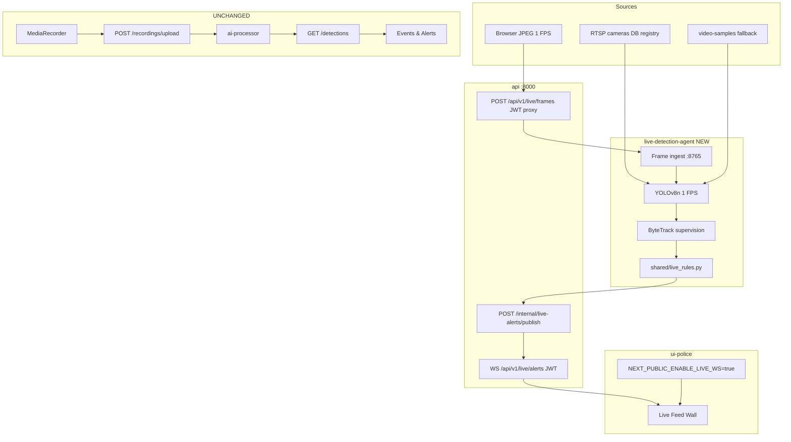

# True Live Surveillance — Implementation Guide

## Architecture



## Files Created

| Path | Purpose |
|------|---------|
| `shared/live_rules.py` | Wrong-way, crowd, congestion rules |
| `live-detection-agent/*` | Independent live pipeline service |
| `api/src/live_alerts_hub.py` | WebSocket + internal publish + frame proxy |
| `ui-police/lib/live-ws-config.ts` | Feature flag |
| `ui-police/lib/use-live-alert-websocket.ts` | WS client hook |
| `ui-police/lib/use-live-frame-pusher.ts` | Browser JPEG ingest (not MediaRecorder) |
| `ui-police/components/live-bbox-overlay.tsx` | Tile bbox rendering |
| `tests/*` | Unit + isolation tests |
| `LIVE_SURVEILLANCE.md` | This document |

## Files Modified (and why safe)

| File | Why modified | Safety |
|------|--------------|--------|
| `api/src/main.py` | `include_router(live_alerts_router)` only | No changes to upload/detections routes |
| `api/requirements.txt` | Added `httpx` for frame proxy | Additive dependency |
| `docker-compose.yml` | Added `live-detection-agent`, API env vars | Recording services untouched |
| `ui-police/components/live-feed-wall.tsx` | Feature-flagged WS UI | Polling + `AI_NOTIFICATIONS` preserved when flag off |

**Not modified:** `use-webcam-recording.ts`, `ai-processor/*`, `detection_service.py`, Events & Alerts page.

## Rollback Plan

1. Set `NEXT_PUBLIC_ENABLE_LIVE_WS=false` (or unset) — UI reverts to prior behavior.
2. `docker compose stop live-detection-agent` — live pipeline stops; recording continues.
3. Remove `app.include_router(live_alerts_router)` from `main.py` if full revert needed.
4. `git revert` the live surveillance commit.

## Environment Variables

### API (`docker-compose` api service)

| Variable | Default | Description |
|----------|---------|-------------|
| `LIVE_ALERT_INTERNAL_SECRET` | `live-internal-dev-secret` | Agent → API publish auth |
| `LIVE_AGENT_INGEST_URL` | `http://live-detection-agent:8765` | Frame proxy target |

### live-detection-agent

| Variable | Default | Description |
|----------|---------|-------------|
| `YOLO_MODEL` | `yolov8n.pt` | Model weights |
| `YOLO_CONFIDENCE` | `0.35` | Detection threshold |
| `FRAME_FPS` | `1` | Sample rate |
| `YOLO_DEVICE` | `cpu` | Inference device |
| `LIVE_BROWSER_CAMERA_IDS` | `1,2,3,...` | UI feed IDs for browser JPEG |
| `LIVE_CROWD_MIN_PERSONS` | `8` | Crowd rule |
| `LIVE_CROWD_DURATION_SEC` | `5` | Crowd persistence |
| `LIVE_CONGESTION_MIN_VEHICLES` | `6` | Congestion density |
| `LIVE_CONGESTION_MAX_SPEED_PX` | `3.0` | Slow traffic threshold |
| `LIVE_CONGESTION_DURATION_SEC` | `8` | Congestion persistence |
| `LIVE_WRONG_WAY_MIN_SPEED_PX` | `2.0` | Min speed for wrong-way |
| `LIVE_WRONG_WAY_DOT_THRESHOLD` | `-0.5` | Opposing direction dot product |
| `LIVE_LANE_DIRECTIONS_JSON` | `{}` | `{"camera-id": [dx, dy]}` |
| `LIVE_ALERT_COOLDOWN_SEC` | `30` | Per-rule debounce |

### Frontend

| Variable | Description |
|----------|-------------|
| `NEXT_PUBLIC_ENABLE_LIVE_WS` | `true` enables WebSocket live alerts |

## Manual Testing

1. `docker compose up --build api live-detection-agent postgres`
2. Set in `ui-police/.env.local`: `NEXT_PUBLIC_ENABLE_LIVE_WS=true`
3. `cd ui-police && pnpm dev`
4. Open Live Feed Wall — confirm **Live AI Connected** badge.
5. Allow webcam — frames push at 1 FPS (separate from REC upload).
6. Trigger test alert:
   ```bash
   curl -X POST http://localhost:8000/api/v1/internal/live-alerts/publish \
     -H "X-Live-Alert-Secret: live-internal-dev-secret" \
     -H "Content-Type: application/json" \
     -d '{"type":"live_alert","camera_id":"1","alert_type":"crowd_gathering","severity":"high","message":"Test crowd","timestamp":"2026-06-10T12:00:00Z","track_ids":[1],"bboxes":[[100,100,200,200]]}'
   ```
7. Verify tile `1` highlights with red overlay and bbox.
8. Confirm Events & Alerts still loads polled detections.
9. Confirm REC badge still appears during webcam recording.

## Automated Tests

```bash
pip install -r tests/requirements.txt
pip install -r api/requirements.txt
pip install supervision numpy
pytest tests/ -v
```

## Known Limitations

- RTSP ingest requires reachable camera URLs; browser cannot preview RTSP directly.
- Browser frame push uses UI `feed.id` strings — must match `LIVE_BROWSER_CAMERA_IDS`.
- Wrong-way rule requires `LIVE_LANE_DIRECTIONS_JSON` per camera.
- YOLO on CPU: ~1 FPS per camera; scale with GPU for production.
- WebSocket JWT in query string — use WSS + short-lived tokens in production.
- `test_websocket_rejects_missing_token` may vary by Starlette version.
