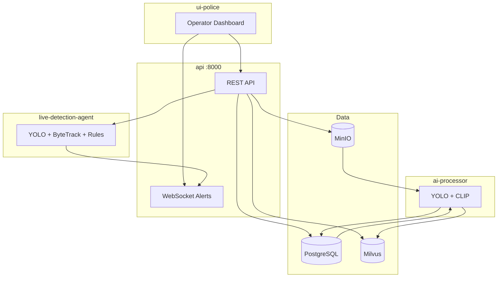

# DigiMitra City

[](https://www.python.org/)
[](https://nextjs.org/)
[](https://fastapi.tiangolo.com/)
[](https://docs.docker.com/compose/)

**DigiMitra City** (branded **Digimitra — AI Surveillance**) is an AI-powered smart city surveillance platform for continuous video ingest, offline analysis, real-time alerting, and natural-language search over recorded footage.

The repository is a **polyglot microservices monorepo**: a Next.js operator dashboard, a FastAPI gateway, offline and live AI workers, and shared data infrastructure orchestrated with Docker Compose. Video is captured from browser webcams, RTSP CCTV cameras, and uploaded files; stored in object storage; indexed with YOLOv8 object detection and CLIP embeddings; and surfaced through semantic search, detection timelines, and a live feed wall with rule-based alerts.

Live surveillance (YOLO + ByteTrack + crowd/congestion/wrong-way rules) runs on a **separate pipeline** from offline DVR indexing, so recording and search remain available even when live inference is under load.

Detailed technical documentation lives in [`docs/`](docs/). Start with the [documentation index](docs/INDEX.md).

---

## Features

- **Continuous DVR recording** — Browser MediaRecorder segments uploaded to object storage
- **Video file upload** — MP4, MOV, AVI, and WebM for retroactive analysis
- **Offline AI indexing** — YOLOv8n detections and CLIP ViT-B-32 embeddings per recording segment
- **Semantic video search** — Natural-language queries over Milvus-indexed frames
- **Live surveillance** — Real-time detection, ByteTrack tracking, and WebSocket alerts
- **Rule-based live alerts** — Crowd gathering, traffic congestion, and wrong-way driving
- **Operator dashboard** — Live feeds, map view, events, recordings, and search (`ui-police`)
- **Camera registry** — Webcam, CCTV (RTSP), and upload source types with geolocation
- **Presigned playback** — Seek-to-detection video playback from object storage
- **Edge ingest pipeline** — Optional video chunking via Redpanda (`edge-agent`, `stream-processor`)

---

## Tech Stack

### Frontend
- Next.js 14 (App Router), React 18, TypeScript 5
- Tailwind CSS 4, shadcn/ui (Radix UI), Framer Motion
- Leaflet / react-leaflet, Recharts
- AWS Amplify v6 (Cognito authentication)

### Backend
- FastAPI, Uvicorn, Pydantic, SQLAlchemy
- python-jose (JWT), passlib (bcrypt)
- Five Python services: `api`, `ai-processor`, `live-detection-agent`, `edge-agent`, `stream-processor`

### Database & Storage
- **PostgreSQL 15** — Relational metadata (cameras, users, segments, detections)
- **Milvus 2.2** — CLIP vector similarity search (`recording_clip_frames`)
- **MinIO** — S3-compatible object storage for video and preview images
- **etcd** — Milvus metadata coordination

### AI / ML
- **YOLOv8n** (Ultralytics) — Object detection (person, vehicles, backpack)
- **CLIP ViT-B-32** (sentence-transformers) — Semantic frame embeddings (512-dim)
- **ByteTrack** (supervision) — Multi-object tracking for live pipeline
- **XCLIP** (transformers) — Video embeddings in edge-agent (legacy path)

### Cloud / Infrastructure
- **AWS Cognito** — Frontend user identity (sign-up, sign-in, email verification)
- Docker Compose — Full local stack (11 services)
- Redpanda — Kafka-compatible event streaming
- nginx — HLS video serving (`nginx-hls`)

### DevOps & Testing
- Docker / Docker Compose 3.8
- pytest — Unit and integration tests (`tests/`)
- No CI/CD pipelines in this repository

### Other
- httpx, websockets — API frame proxy and live alert hub
- OpenCV — Frame extraction and RTSP ingest

---

## System Overview

Operators use the **Next.js dashboard** to monitor live feeds, review detections, search recordings, and manage cameras. The dashboard authenticates via **AWS Cognito**; API calls use a separate **JWT** from `POST /api/v1/token`.

Two pipelines share camera metadata and storage but run independently:

1. **Recording / offline** — Upload → MinIO → `recording_segments` → `ai-processor` (YOLO + CLIP) → PostgreSQL + Milvus → semantic search and events API
2. **Live** — Browser JPEG or RTSP → `live-detection-agent` → rule engine → API WebSocket → live feed wall



See [Architecture](docs/06_ARCHITECTURE.md) and [LIVE_SURVEILLANCE.md](LIVE_SURVEILLANCE.md) for full design detail.

---

## Repository Structure

```
Digimitra-city/
├── api/                    # FastAPI REST + WebSocket gateway (port 8000)
├── ai-processor/           # Offline YOLO + CLIP indexing worker
├── live-detection-agent/   # Real-time YOLO + ByteTrack + live rules (port 8765)
├── edge-agent/             # Video chunker + XCLIP + Redpanda publisher
├── stream-processor/       # Redpanda consumer → PostgreSQL
├── shared/                 # SQLAlchemy models, Milvus helpers, live rules
├── ui-police/              # Next.js 14 operator dashboard
├── tests/                  # pytest suite
├── scripts/                # Maintenance utilities
├── docs/                   # Full project documentation
├── docker-compose.yml      # Stack orchestration
├── LIVE_SURVEILLANCE.md    # Live pipeline guide
└── STREAMING_SETUP.md      # Browser webcam setup guide
```

---

## Getting Started

### Prerequisites

- [Docker Desktop](https://www.docker.com/products/docker-desktop/) (or Docker Engine + Compose)
- [Node.js](https://nodejs.org/) 18+ and [pnpm](https://pnpm.io/) (frontend development)
- Python 3.9+ (optional, for running tests locally)
- 8 GB+ RAM recommended (Milvus and YOLO models)

### Installation

```bash
git clone <repository-url>
cd Digimitra-city
docker compose up --build
```

### Environment configuration

**Backend** — Defaults are set in `docker-compose.yml`. For production, override secrets such as `JWT_SECRET`, `ALLOW_ANY_LOGIN`, and `LIVE_ALERT_INTERNAL_SECRET`. See [Deployment Guide](docs/11_DEPLOYMENT_GUIDE.md).

**Frontend** — Create `ui-police/.env.local`:

```env
NEXT_PUBLIC_SURVEILLANCE_API_URL=http://localhost:8000
NEXT_PUBLIC_ENABLE_LIVE_WS=true
NEXT_PUBLIC_COGNITO_USER_POOL_ID=<your-pool-id>
NEXT_PUBLIC_COGNITO_CLIENT_ID=<your-client-id>
NEXT_PUBLIC_AWS_REGION=<your-region>
```

Cognito variables are required for sign-up and login. The API uses `ALLOW_ANY_LOGIN=true` in the default Compose file for development tokens.

### Build

```bash
# Backend images (via Compose)
docker compose build

# Frontend production build
cd ui-police
pnpm install
pnpm build
```

### Development commands

```bash
# Minimal backend stack
docker compose up --build api ai-processor live-detection-agent postgres minio milvus

# Frontend dev server
cd ui-police && pnpm dev

# Run tests
pip install -r tests/requirements.txt -r api/requirements.txt
pip install supervision numpy
pytest tests/ -v
```

| Service | URL |
|---------|-----|
| Dashboard | http://localhost:3000 |
| API (Swagger) | http://localhost:8000/docs |
| MinIO Console | http://localhost:9001 |
| Redpanda Console | http://localhost:8080 |

### Production run

```bash
docker compose up --build -d
cd ui-police && pnpm build && pnpm start
```

Production hardening (disable dev auth, TLS, GPU inference, managed databases) is described in [docs/11_DEPLOYMENT_GUIDE.md](docs/11_DEPLOYMENT_GUIDE.md). No automated production deploy scripts are included in this repository.

---

## Documentation

Full documentation is in [`docs/`](docs/). Entry point: **[docs/INDEX.md](docs/INDEX.md)**.

### Core documents

| Document | Purpose |
|----------|---------|
| [docs/INDEX.md](docs/INDEX.md) | Master index and cross-reference map |
| [docs/01_README.md](docs/01_README.md) | Detailed project overview, install, and configuration |
| [docs/02_PROBLEM_STATEMENT.md](docs/02_PROBLEM_STATEMENT.md) | Problem domain, motivation, and expected impact |
| [docs/03_USE_CASES.md](docs/03_USE_CASES.md) | Actors, use cases, and interaction flows |
| [docs/04_SRS.md](docs/04_SRS.md) | Software Requirements Specification (IEEE 830) |
| [docs/05_SOFTWARE_DESIGN_DOCUMENT.md](docs/05_SOFTWARE_DESIGN_DOCUMENT.md) | Subsystem, database, AI, and security design |
| [docs/06_ARCHITECTURE.md](docs/06_ARCHITECTURE.md) | High-level, deployment, and infrastructure architecture |
| [docs/07_API_DOCUMENTATION.md](docs/07_API_DOCUMENTATION.md) | REST and WebSocket API reference |
| [docs/08_DATABASE_DOCUMENTATION.md](docs/08_DATABASE_DOCUMENTATION.md) | PostgreSQL, Milvus, MinIO, and Redpanda schemas |
| [docs/09_USER_MANUAL.md](docs/09_USER_MANUAL.md) | Operator guide, troubleshooting, and FAQ |
| [docs/10_TESTING_MANUAL.md](docs/10_TESTING_MANUAL.md) | Testing strategy, test cases, and security checklist |
| [docs/11_DEPLOYMENT_GUIDE.md](docs/11_DEPLOYMENT_GUIDE.md) | Docker, AWS, secrets, scaling, and rollback |
| [docs/12_FUTURE_WORK.md](docs/12_FUTURE_WORK.md) | Categorized roadmap (90+ improvements) |

### Diagrams and developer guides

| Document | Purpose |
|----------|---------|
| [docs/architecture-4plus1/README.md](docs/architecture-4plus1/README.md) | Kruchten 4+1 architectural views |
| [docs/uml/README.md](docs/uml/README.md) | UML diagrams (Mermaid and PlantUML) |
| [docs/data-flow/README.md](docs/data-flow/README.md) | Data flow diagrams (DFD Level 0–2) and pipeline flows |
| [docs/sequences/README.md](docs/sequences/README.md) | Sequence diagrams for key system flows |
| [docs/developer/README.md](docs/developer/README.md) | Folder structure, standards, and extension points |

### Repository guides

| Document | Purpose |
|----------|---------|
| [LIVE_SURVEILLANCE.md](LIVE_SURVEILLANCE.md) | Live detection pipeline implementation and testing |
| [STREAMING_SETUP.md](STREAMING_SETUP.md) | Browser webcam streaming setup |

---

## Screenshots

> Screenshots are not yet included in the repository. Add images under `docs/assets/screenshots/` and link them here.

| Screen | Description |
|--------|-------------|
| *Login* | Cognito sign-in page |
| *Dashboard* | Main operator overview |
| *Live Feed Wall* | Multi-camera tiles with live alerts |
| *Semantic Search* | Natural-language search results |
| *Events & Alerts* | Detection timeline with playback |

---

## Project Status

**Version:** 0.1.0 (frontend package)

| Area | Status |
|------|--------|
| DVR recording and playback | Implemented |
| Offline YOLO + CLIP indexing | Implemented |
| Semantic search (CLIP + Milvus) | Implemented |
| Live surveillance and WebSocket alerts | Implemented |
| Operator dashboard | Implemented |
| AWS Cognito frontend auth | Implemented |
| Edge agent + stream processor | Implemented (legacy path) |
| AI assistant (`/api/v1/ai/ask`) | Mock only |
| Text search (`/api/v1/search/text`) | Placeholder |
| CI/CD automation | Not in repository |
| Production IaC (Terraform/K8s) | Not in repository |

---

## Future Work

Roadmap items (short-, medium-, and long-term improvements across AI, cloud, security, and UI) are maintained in **[docs/12_FUTURE_WORK.md](docs/12_FUTURE_WORK.md)**.

---

## Contributing

1. Fork the repository and create a feature branch from `main`.
2. Follow existing patterns in `shared/` for models and in service-specific folders for logic.
3. Keep live and offline pipeline changes isolated (see [LIVE_SURVEILLANCE.md](LIVE_SURVEILLANCE.md)).
4. Run `pytest tests/ -v` before opening a pull request.
5. Update relevant files under `docs/` when changing APIs, schemas, or architecture.

---

## License

License to be added.

---

## Authors

DigiMitra City — development team.

_Contributor names are not listed in repository metadata. Update this section when authors are defined._
