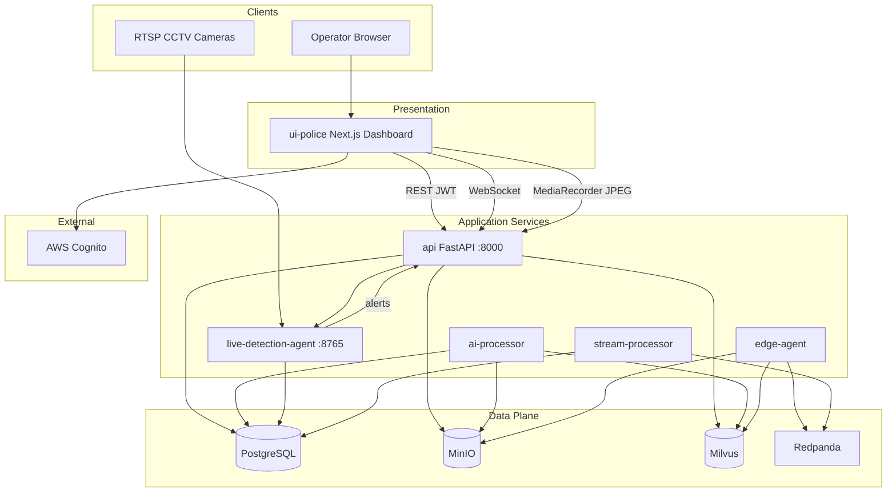
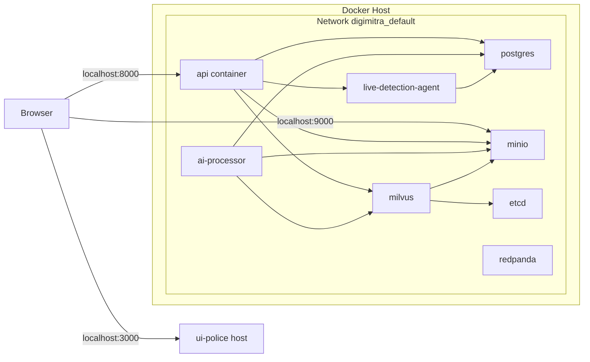
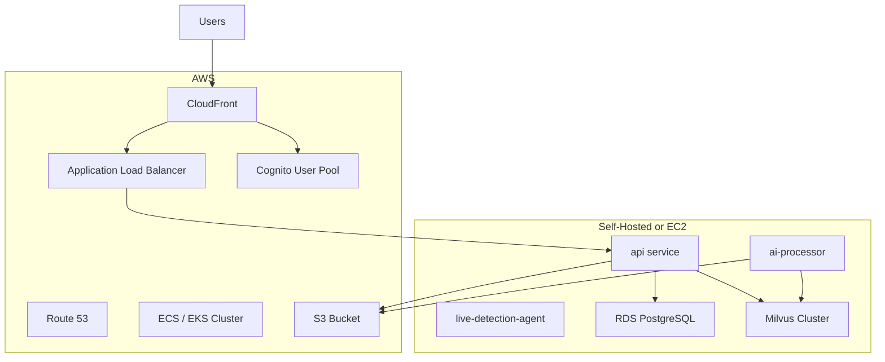
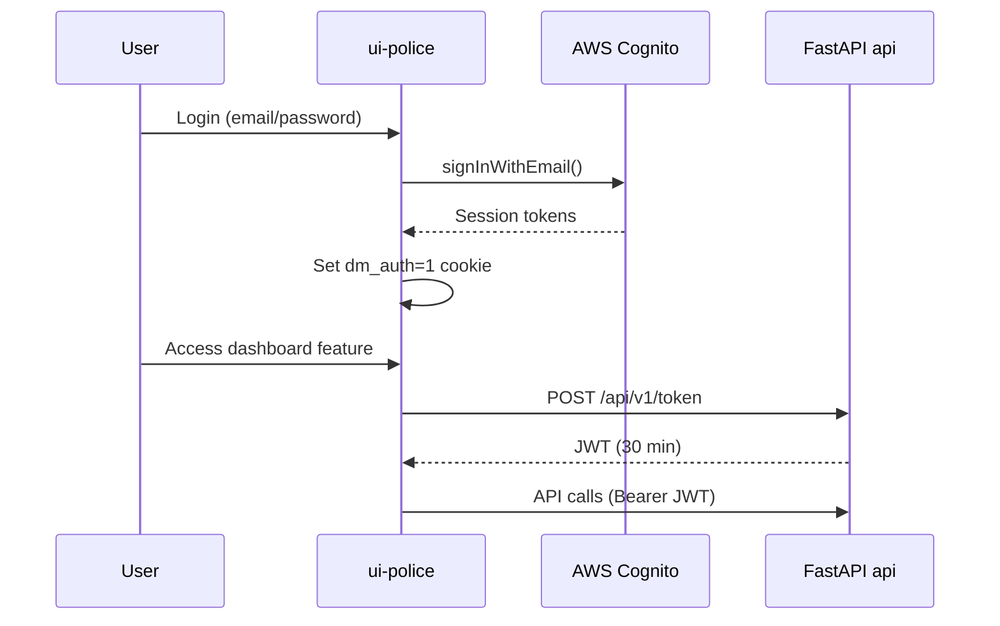

# Architecture Document

**Document:** 06 — System Architecture  
**Project:** DigiMitra City

---

## 1. High-Level Architecture

DigiMitra City is an **event-driven, microservices-based AI surveillance platform** that separates concerns across ingest, storage, offline analytics, live analytics, and presentation layers.



---

## 2. Component Architecture

| Component | Technology | Port | Responsibility |
|-----------|------------|------|----------------|
| **ui-police** | Next.js 14, React 18 | 3000 | Operator dashboard, auth UI, live feeds |
| **api** | FastAPI, Uvicorn | 8000 | REST API, WebSocket hub, frame proxy |
| **live-detection-agent** | FastAPI + OpenCV + YOLO | 8765 | Real-time detection, tracking, rules |
| **ai-processor** | Python worker | — | Offline YOLO + CLIP indexing |
| **edge-agent** | Python worker | — | Video chunking, XCLIP, Kafka publish |
| **stream-processor** | Python consumer | — | Kafka → PostgreSQL persistence |
| **postgres** | PostgreSQL 15 | 5432 | Relational metadata |
| **minio** | MinIO | 9000/9001 | Video/thumbnail object storage |
| **milvus** | Milvus 2.2.13 | 19530 | Vector similarity search |
| **etcd** | etcd 3.5.7 | 2379 | Milvus metadata store |
| **redpanda** | Redpanda | 9092 | Event streaming (Kafka API) |
| **redpanda-console** | Redpanda Console | 8080 | Topic inspection UI |
| **nginx-hls** | nginx:alpine | 8088 | HLS video serving |

---

## 3. Logical Architecture

### 3.1 Layer Model

| Layer | Components | Concerns |
|-------|------------|----------|
| **Presentation** | ui-police | UX, auth cookies, API client, WebSocket client |
| **API Gateway** | api (main.py, live_alerts_hub.py) | Routing, auth, CORS, orchestration |
| **Processing** | ai-processor, live-detection-agent, edge-agent | AI inference, rules, chunking |
| **Messaging** | Redpanda, WebSocket hub | Async events, real-time push |
| **Persistence** | PostgreSQL, MinIO, Milvus | Structured, blob, vector data |

### 3.2 Pipeline Isolation

The **live pipeline** and **recording pipeline** are architecturally decoupled:

| Aspect | Live Pipeline | Recording Pipeline |
|--------|---------------|-------------------|
| Trigger | Real-time frames | Segment upload complete |
| Detection store | WebSocket only (not DB) | `recording_detections` table |
| AI worker | live-detection-agent | ai-processor |
| Searchable | No (ephemeral) | Yes (Milvus + PostgreSQL) |
| Frame rate | ~1 FPS | Sampled every 3s |

This isolation is validated by `tests/test_pipeline_isolation.py`.

---

## 4. Deployment Architecture



**Volume mounts:**
- `minio_data`, `pg_data`, `milvus_data`, `hls_data` — persistent Docker volumes
- `./video-samples` — read-only sample videos for edge-agent and live-agent fallback
- `./shared`, service source dirs — development hot reload

---

## 5. Infrastructure Architecture

### 5.1 Data Store Roles

| Store | Data | Access Pattern |
|-------|------|----------------|
| **PostgreSQL** | Cameras, users, segments, detections, events | CRUD, relational queries |
| **MinIO** | Video segments, detection preview images | Write-once, presigned read |
| **Milvus** | CLIP frame embeddings (512-dim) | Approximate nearest neighbor (FLAT/IP) |
| **etcd** | Milvus internal metadata | Milvus-managed |
| **Redpanda** | Edge events, chunk metadata | Pub/sub, consumer groups |

### 5.2 Network Ports (Development)

| Port | Service | Protocol |
|------|---------|----------|
| 3000 | ui-police | HTTP |
| 8000 | api | HTTP/WS |
| 8765 | live-detection-agent | HTTP |
| 5432 | postgres | TCP |
| 9000 | minio API | HTTP |
| 9001 | minio console | HTTP |
| 19530 | milvus gRPC | TCP |
| 9092 | redpanda Kafka | TCP |
| 8080 | redpanda console | HTTP |
| 8088 | nginx-hls | HTTP |

---

## 6. Cloud Architecture

### 6.1 Current State

The repository contains **no Terraform, CloudFormation, or Kubernetes manifests**. Deployment is Docker Compose-based with self-hosted infrastructure.

### 6.2 AWS Integration (Frontend Only)

| Service | Usage |
|---------|-------|
| **AWS Cognito** | User Pool for sign-up, sign-in, email verification |
| **Amplify Auth SDK** | Frontend integration (`ui-police/lib/cognito.ts`) |

### 6.3 Recommended Cloud Architecture (Assumption)

> The following is a **recommended production topology**, not implemented in code:



**Migration notes:**
- MinIO → AWS S3 (S3-compatible API; `storage_service.py` adaptation needed)
- PostgreSQL → Amazon RDS
- MinIO presign → S3 presign
- Cognito → federate with API JWT via OIDC

---

## 7. Microservice Communication

| From | To | Protocol | Auth |
|------|----|----------|------|
| ui-police | api | HTTPS REST | Bearer JWT |
| ui-police | api | WebSocket | JWT query param |
| api | live-detection-agent | HTTP POST | X-Live-Alert-Secret |
| live-detection-agent | api | HTTP POST | X-Live-Alert-Secret |
| ai-processor | postgres | TCP/SQL | Connection string |
| ai-processor | minio | HTTP S3 API | Access key |
| ai-processor | milvus | gRPC | Host/port |
| edge-agent | redpanda | Kafka protocol | Bootstrap servers |
| stream-processor | redpanda | Kafka consumer | Bootstrap servers |
| edge-agent | minio | HTTP S3 API | Access key |
| edge-agent | milvus | gRPC | Host/port |

**No direct service-to-service gRPC.** All inter-service communication uses HTTP REST, WebSocket, Kafka, or shared database/storage.

---

## 8. Data Flow

### 8.1 Recording Data Flow

```
Browser MediaRecorder
  → POST /recordings/upload
  → MinIO (video-chunks/)
  → PostgreSQL (recording_segments)
  → ai-processor (poll queue)
  → YOLO → recording_detections
  → CLIP → Milvus recording_clip_frames
  → GET /semantic-search → UI
```

### 8.2 Live Alert Data Flow

```
Browser JPEG / RTSP
  → live-detection-agent (YOLO + ByteTrack)
  → shared/live_rules.py
  → POST /internal/live-alerts/publish
  → WebSocket broadcast
  → ui-police Live Feed Wall
```

Detailed DFDs: [data-flow/README.md](./data-flow/README.md)

---

## 9. Event Flow

| Event | Producer | Transport | Consumer | Persistence |
|-------|----------|-----------|----------|-------------|
| `live_alert` | live-detection-agent | HTTP → WS | ui-police | Ephemeral (not stored) |
| `region-1-events` | edge-agent | Redpanda | stream-processor | PostgreSQL `events` |
| `region-1-chunks` | edge-agent | Redpanda | stream-processor | PostgreSQL |
| Segment uploaded | api | DB write | ai-processor (poll) | PostgreSQL + MinIO |
| AI scan complete | ai-processor | DB update | api (on query) | PostgreSQL + Milvus |

---

## 10. Authentication Architecture



> **Design gap:** Cognito session and API JWT are independent. The frontend obtains API JWT with a separate call using the Cognito username.

---

## 11. Technology Decisions

| Decision | Rationale |
|----------|-----------|
| PostgreSQL over MongoDB | Relational integrity for segments/detections; SQLAlchemy ORM |
| Milvus for vectors | Purpose-built ANN search; 512-dim CLIP embeddings |
| MinIO over direct S3 | Self-hosted dev parity; S3-compatible API |
| Redpanda over Kafka | Lightweight Kafka-compatible broker for edge pipeline |
| Decoupled live/offline pipelines | Prevent live inference from blocking DVR indexing |
| YOLOv8n on CPU | Deployable without GPU; ~1 FPS acceptable for alerting |
| FastAPI | Async support, OpenAPI auto-docs, WebSocket native |
| Next.js App Router | SSR, middleware auth, modern React patterns |

---

## Related Documents

- [05_SOFTWARE_DESIGN_DOCUMENT.md](./05_SOFTWARE_DESIGN_DOCUMENT.md)
- [architecture-4plus1/README.md](./architecture-4plus1/README.md)
- [data-flow/README.md](./data-flow/README.md)
- [sequences/README.md](./sequences/README.md)
- [LIVE_SURVEILLANCE.md](../LIVE_SURVEILLANCE.md)
