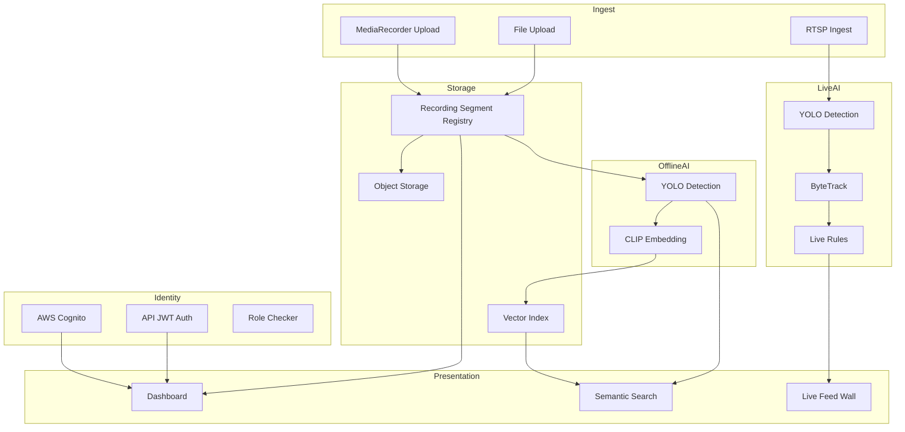
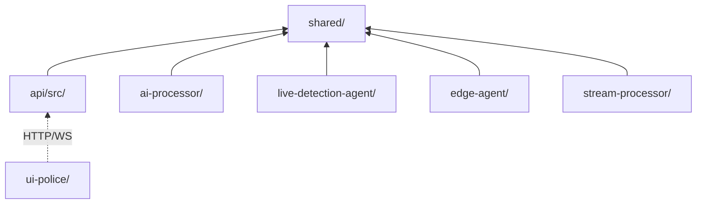
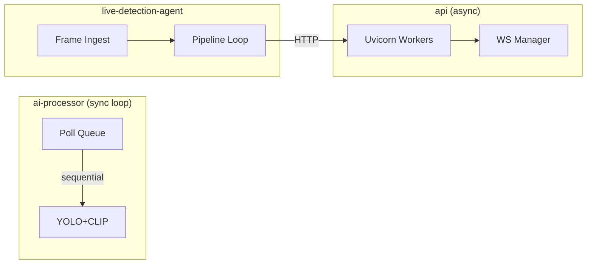
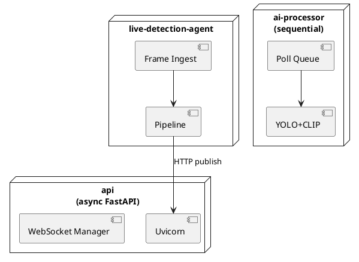
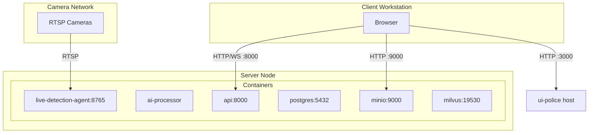
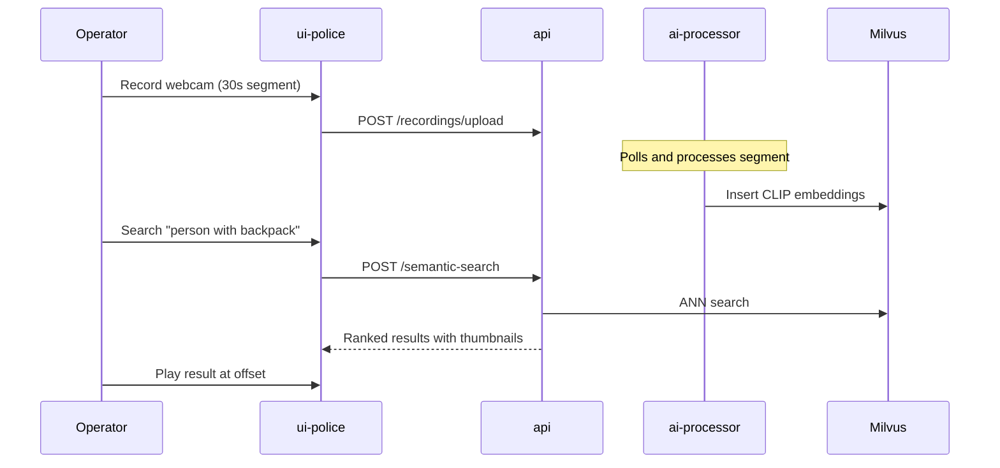
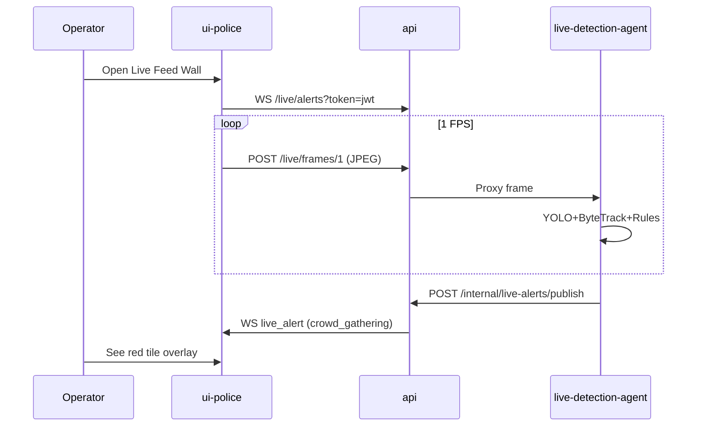

# 4+1 Architectural Views — DigiMitra City

**Document:** Kruchten 4+1 Architecture Model  
**Reference:** Philippe Kruchten, "Architectural Blueprints—The '4+1' View Model of Software Architecture"

---

## Overview

The 4+1 model decomposes DigiMitra City architecture into five complementary views, each addressing different stakeholder concerns. Together they provide a complete picture without a single overwhelming diagram.

| View | Stakeholder | Concern |
|------|-------------|---------|
| **Logical** | Developers, architects | Functionality, domain model |
| **Development** | Developers, build engineers | Module organization, dependencies |
| **Process** | DevOps, performance engineers | Runtime processes, concurrency |
| **Physical** | Operations, infrastructure | Deployment topology, hardware |
| **Scenarios** | All stakeholders | End-to-end validation |

---

## 1. Logical View

**Purpose:** Describes the functional structure — what the system does and how responsibilities are divided.

### Explanation

The logical view organizes DigiMitra into four functional areas:

1. **Identity & Access** — Cognito frontend auth, API JWT, role-based access
2. **Video Ingest & Storage** — Recording upload, MinIO storage, segment registry
3. **AI Analytics** — Offline YOLO+CLIP indexing, live YOLO+ByteTrack+rules
4. **Search & Presentation** — Semantic search, detection timeline, live feed wall

The key architectural invariant is **pipeline isolation**: live analytics and offline analytics are logically separate subsystems sharing only the camera registry and API gateway.

### Mermaid



### PlantUML

```plantuml
@startuml LogicalView
package "Identity" { [Cognito] [JWT] }
package "Ingest" { [MediaRecorder] [FileUpload] [RTSP] }
package "Storage" { [SegmentRegistry] [ObjectStorage] [VectorIndex] }
package "OfflineAI" { [YOLO] [CLIP] }
package "LiveAI" { [YOLOLive] [ByteTrack] [Rules] }
package "Presentation" { [Dashboard] [Search] [LiveWall] }
[MediaRecorder] --> [SegmentRegistry]
[SegmentRegistry] --> [YOLO]
[YOLO] --> [CLIP] --> [VectorIndex]
[RTSP] --> [YOLOLive] --> [ByteTrack] --> [Rules]
[VectorIndex] --> [Search]
@enduml
```

---

## 2. Development View

**Purpose:** Describes the static organization of source code modules and their dependencies.

### Explanation

DigiMitra is a **monorepo** with five Python service packages and one Next.js frontend. The `shared/` Python package is imported by all backend services via `PYTHONPATH=/app`. This avoids code duplication for ORM models, Milvus helpers, and live rules.

**Dependency rules:**
- `shared/` has no service dependencies (leaf package)
- `api/` depends on `shared/` only (not on ai-processor or live-agent)
- `ai-processor/` and `live-detection-agent/` depend on `shared/` only
- `ui-police/` communicates with `api/` exclusively via HTTP/WebSocket

### Mermaid



### PlantUML

```plantuml
@startuml DevelopmentView
package "shared" { [models.py] [live_rules.py] [recording_clip_milvus.py] }
package "api" { [main.py] [auth.py] [recording_service.py] }
package "ai-processor" { [scheduler.py] [detector.py] }
package "live-detection-agent" { [pipeline.py] [tracker.py] }
package "ui-police" { [app/] [lib/surveillance-api.ts] }

api --> shared
ai-processor --> shared
live-detection-agent --> shared
ui-police ..> api : REST/WS
@enduml
```

---

## 3. Process View

**Purpose:** Describes runtime processes, concurrency, and inter-process communication.

### Explanation

At runtime, DigiMitra executes as independent Docker containers:

| Process | Concurrency Model | Communication |
|---------|-------------------|---------------|
| `api` | Async (FastAPI/Uvicorn) | HTTP REST, WebSocket |
| `ai-processor` | Single-threaded sequential queue | DB poll, MinIO, Milvus |
| `live-detection-agent` | Per-camera frame loops | HTTP ingest, HTTP alert publish |
| `edge-agent` | File processing loop | Kafka produce |
| `stream-processor` | Kafka consumer | Kafka consume, DB write |
| `ui-police` | Node.js event loop | HTTP client, WebSocket client |

**Critical process isolation:** The ai-processor and live-detection-agent never communicate directly. Both write/read through shared infrastructure (PostgreSQL, MinIO, Milvus) or via the API gateway (live alerts).

### Mermaid



### PlantUML



---

## 4. Physical View

**Purpose:** Maps software components to hardware nodes and network topology.

### Explanation

In the default development deployment, all containers run on a single Docker host. Production would distribute components across nodes:

| Node | Components | Hardware |
|------|------------|----------|
| App Server | api, ui-police | 4 CPU, 8 GB RAM |
| AI Server | ai-processor, live-detection-agent | GPU recommended, 8+ CPU |
| Data Server | postgres, minio, milvus, etcd | SSD storage, 16+ GB RAM |
| Messaging | redpanda | 2 CPU, 4 GB RAM |

### Mermaid



### PlantUML

```plantuml
@startuml PhysicalView
node "Client Workstation" { [Browser] }
node "Docker Host" {
  artifact "api :8000" as API
  artifact "ai-processor" as AIP
  artifact "live-detection-agent :8765" as LDA
  database "postgres" as PG
  database "minio" as MI
  database "milvus" as MV
}
node "Camera Network" { [RTSP Cameras] as CAM }
[Browser] --> API
[Browser] --> MI
CAM --> LDA
@enduml
```

---

## 5. Scenarios View (+1)

**Purpose:** Validates the architecture through key end-to-end scenarios that tie all views together.

### Scenario 1: Operator Semantic Search After Recording



**Views exercised:** Logical (Ingest→AI→Search), Process (sequential ai-processor), Physical (browser→api→milvus), Development (shared/models, recording_clip_search).

### Scenario 2: Live Crowd Alert



**Views exercised:** Logical (LiveAI→Presentation), Process (async WS + sync pipeline), Physical (browser→api→lda), Development (live_alerts_hub, live_rules).

### Scenario 3: Video File Upload Investigation

1. Investigator uploads MP4 via `video-file-upload.tsx`
2. API stores in MinIO, registers segment
3. ai-processor indexes with YOLO + CLIP
4. Investigator queries Events & Alerts for `object_type=car`
5. Clicks detection → playback seeks to `timestamp_offset_ms`

---

## View Correspondence Matrix

| Scenario | Logical | Development | Process | Physical |
|----------|---------|-------------|---------|----------|
| Semantic Search | Ingest→AI→Search | api + ai-processor + shared | Sequential queue | Single Docker host |
| Live Alert | LiveAI→Presentation | api + lda + shared | Async WS + sync loop | Browser + agent |
| File Upload | Ingest→AI→Events | api + ai-processor | Poll + process | MinIO + PG |

---

## Related Documents

- [06_ARCHITECTURE.md](../06_ARCHITECTURE.md)
- [uml/README.md](../uml/README.md)
- [sequences/README.md](../sequences/README.md)
- [03_USE_CASES.md](../03_USE_CASES.md)
