# Data Flow Diagrams — DigiMitra City

**Document:** DFD & Pipeline Flow Documentation

---

## DFD Level 0 (Context Diagram)

The system as a single process interacting with external entities.

### Mermaid

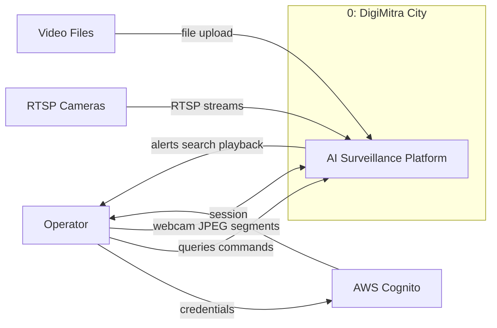

### PlantUML

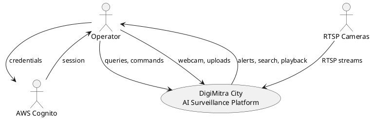

---

## DFD Level 1

Major sub-processes within DigiMitra City.

### Mermaid

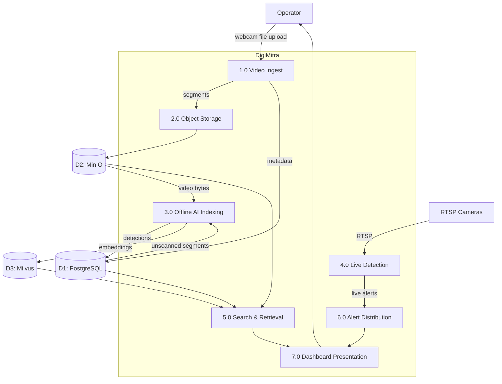

### PlantUML

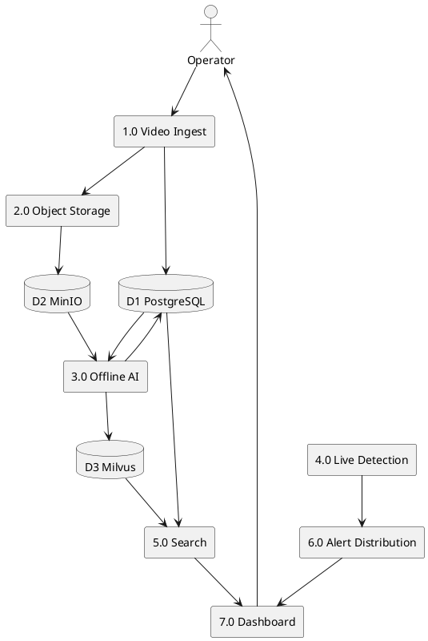

---

## DFD Level 2 — Process 1.0 Video Ingest

### Mermaid

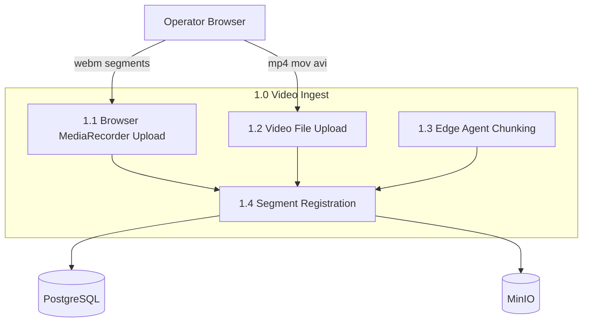

### PlantUML

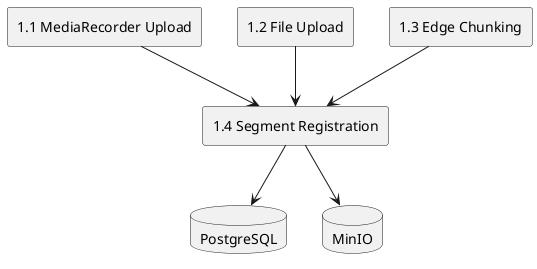

---

## DFD Level 2 — Process 3.0 Offline AI Indexing

### Mermaid

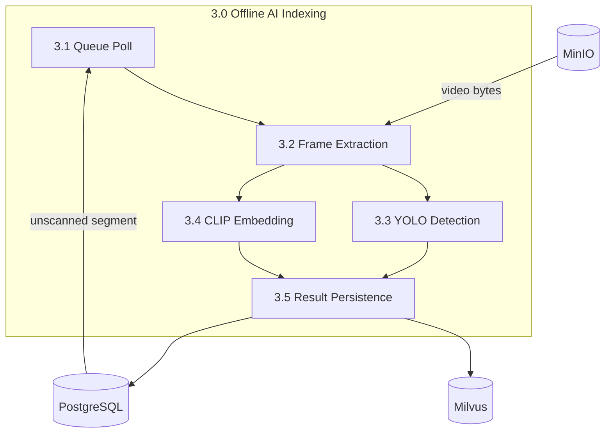

---

## DFD Level 2 — Process 4.0 Live Detection

### Mermaid

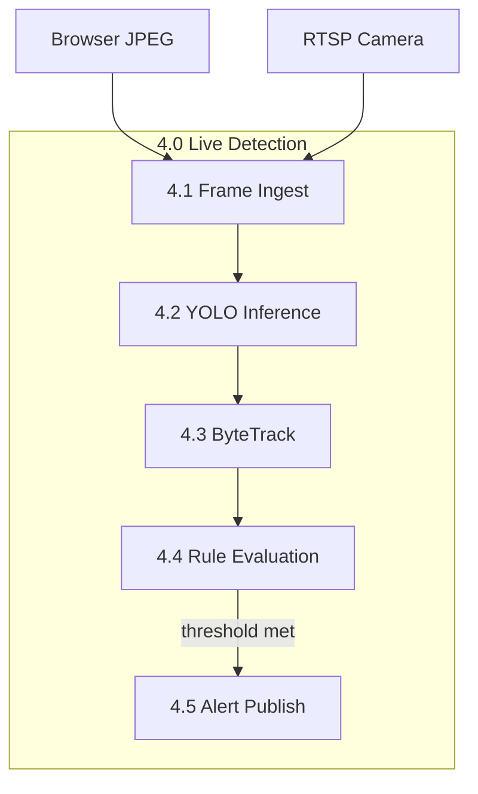

---

## Pipeline Flow — Recording Path

```
┌─────────────┐    ┌──────────┐    ┌─────────────┐    ┌──────────────┐
│  Browser    │───►│   api    │───►│   MinIO     │    │  PostgreSQL  │
│ MediaRecorder│    │  upload  │    │ video-chunks│    │recording_segs│
└─────────────┘    └──────────┘    └──────┬──────┘    └──────┬───────┘
                                          │                   │
                                          ▼                   ▼
                                   ┌──────────────┐    ┌──────────────┐
                                   │ ai-processor │◄───│  poll queue  │
                                   │ YOLO + CLIP  │    └──────────────┘
                                   └──────┬───────┘
                                          │
                          ┌───────────────┼───────────────┐
                          ▼               ▼               ▼
                   ┌────────────┐  ┌────────────┐  ┌────────────┐
                   │ detections │  │  Milvus    │  │  previews  │
                   │ PostgreSQL │  │  vectors   │  │   MinIO    │
                   └────────────┘  └────────────┘  └────────────┘
```

### Mermaid

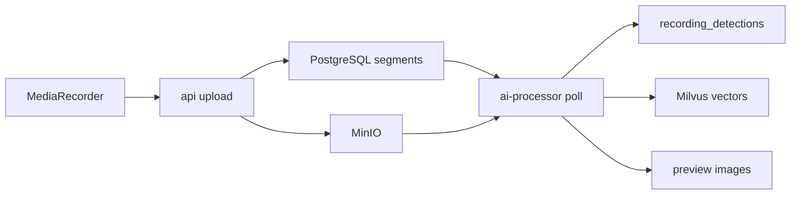

---

## Streaming Flow — Live Path

```
┌──────────┐    ┌──────────┐    ┌─────────────────────┐    ┌──────────┐
│ Browser  │───►│   api    │───►│ live-detection-agent│───►│live_rules│
│ JPEG 1fps│    │  proxy   │    │ YOLO + ByteTrack    │    └────┬─────┘
└──────────┘    └──────────┘    └─────────────────────┘         │
     ▲                                                          ▼
     │                                                    ┌──────────┐
     │         ┌──────────┐    ┌──────────┐               │  alert   │
     └─────────│ui-police  │◄───│   api    │◄──────────────│ publish  │
               │ Live Wall │ WS │ broadcast│               └──────────┘
               └──────────┘    └──────────┘
```

### Mermaid

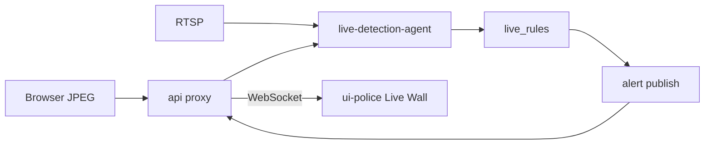

---

## Inference Flow — Offline (ai-processor)

| Step | Component | Input | Output |
|------|-----------|-------|--------|
| 1 | `scheduler._pick_next_segment()` | PostgreSQL query | `RecordingSegment` row |
| 2 | `utils.download_object()` | MinIO object_key | Raw video bytes |
| 3 | `frame_extractor.iter_spaced_frames()` | Video bytes | Sampled frames (every 3s) |
| 4 | `detector.run_detection()` | Frame image | Bounding boxes + labels |
| 5 | `clip_embedder.embed_frame()` | Frame image | 512-dim vector |
| 6 | PostgreSQL insert | Detection dict | `recording_detections` row |
| 7 | `insert_frame_embeddings()` | Vector + metadata | Milvus row |
| 8 | Segment update | — | `ai_scan_completed_at` set |

### Mermaid

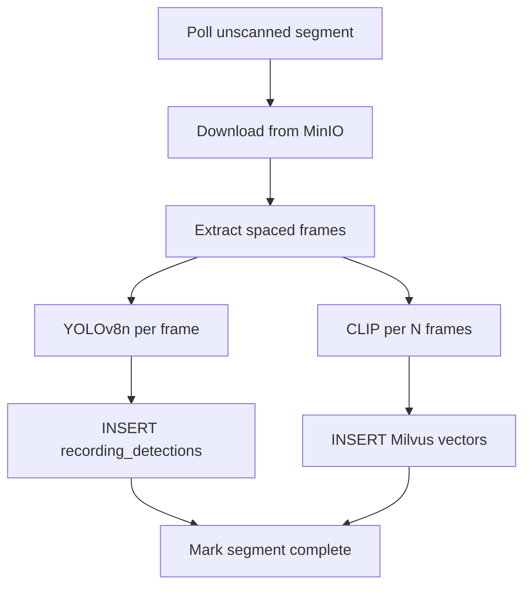

---

## Inference Flow — Live (live-detection-agent)

| Step | Component | Input | Output |
|------|-----------|-------|--------|
| 1 | `frame_source` | RTSP/JPEG/video file | BGR frame |
| 2 | `detector.detect()` | Frame | Raw YOLO detections |
| 3 | `tracker.update()` | Detections | `TrackedObject` list |
| 4 | `live_rules.evaluate()` | Tracked objects | `LiveAlert` or None |
| 5 | `alert_client.publish()` | LiveAlert dict | HTTP POST to api |

---

## Database Flow

### Write Path

```
Upload API ──► recording_segments (INSERT)
            ──► MinIO (PUT object)

ai-processor ──► recording_detections (INSERT batch)
             ──► recording_clip_frames (Milvus INSERT)
             ──► recording_segments (UPDATE ai_scan_*)

live-detection-agent ──► cameras (READ only)
                     ──► (no detection writes — pipeline isolation)
```

### Read Path

```
GET /recordings ──► recording_segments (SELECT paginated)
                 ──► MinIO (presign preview)

POST /semantic-search ──► Milvus (ANN search)
                       ──► recording_segments (validity filter)
                       ──► recording_detections (attach matches)

GET /detections ──► recording_detections JOIN recording_segments
```

### Delete Path

```
DELETE /recordings/{id} ──► MinIO (DELETE object)
                        ──► Milvus (purge vectors)
                        ──► recording_segments (DELETE, CASCADE detections)
```

### Mermaid

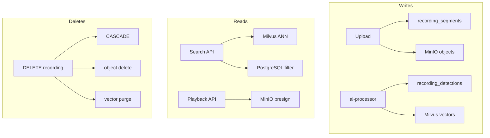

---

## Related Documents

- [06_ARCHITECTURE.md](../06_ARCHITECTURE.md)
- [08_DATABASE_DOCUMENTATION.md](../08_DATABASE_DOCUMENTATION.md)
- [sequences/README.md](../sequences/README.md)
