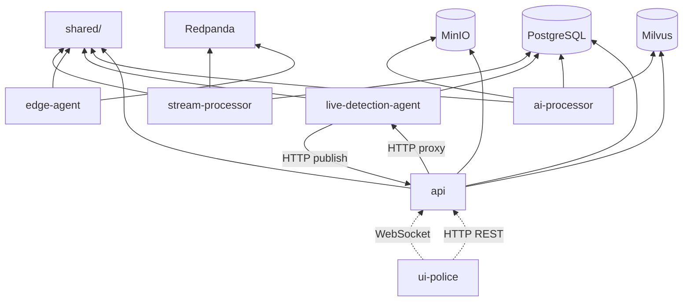

# Developer Documentation — DigiMitra City

**Document:** Developer Guide  
**Audience:** Software engineers extending or maintaining DigiMitra City

---

## 1. Folder Structure

```
Digimitra-city/
├── api/                          # FastAPI backend service
│   ├── Dockerfile
│   ├── requirements.txt
│   └── src/
│       ├── main.py               # App entry, route definitions
│       ├── auth.py               # JWT, bcrypt, role_checker
│       ├── database.py           # SQLAlchemy engine/session
│       ├── schemas.py            # Pydantic models
│       ├── services.py           # Legacy surveillance services
│       ├── recording_service.py  # Segment CRUD, semantic filters
│       ├── detection_service.py  # Detection queries
│       ├── recording_clip_search.py  # CLIP+Milvus search
│       ├── recording_thumbnail_service.py
│       ├── storage_service.py    # MinIO operations
│       ├── video_file_upload.py  # File upload validation
│       ├── live_alerts_hub.py    # WebSocket + frame proxy
│       ├── ai_service.py         # Mock AI Q&A
│       └── vector_service.py     # Legacy Milvus service
│
├── ai-processor/                 # Offline AI worker
│   ├── Dockerfile
│   ├── requirements.txt
│   ├── app.py                    # Entry: scheduler.run_forever()
│   ├── scheduler.py              # Sequential queue orchestration
│   ├── detector.py               # YOLOv8n wrapper
│   ├── clip_embedder.py          # CLIP embeddings
│   ├── frame_extractor.py        # Video frame sampling
│   ├── models.py                 # Local model helpers
│   └── utils.py                  # MinIO download/upload
│
├── live-detection-agent/         # Real-time detection service
│   ├── Dockerfile
│   ├── app.py                    # Pipeline startup
│   ├── pipeline.py               # Main detection loop
│   ├── detector.py               # YOLO wrapper
│   ├── tracker.py                # ByteTrack (supervision)
│   ├── frame_source.py           # RTSP/JPEG/video sources
│   ├── camera_registry.py        # PostgreSQL camera loader
│   ├── ingest_server.py          # HTTP frame ingest :8765
│   ├── alert_client.py           # Alert HTTP publisher
│   └── config.py                 # Env-driven config
│
├── edge-agent/                   # Video file chunker (legacy)
│   ├── Dockerfile
│   └── src/
│       ├── main.py               # XCLIP + YOLO chunker
│       └── edge_orchestrator.py
│
├── stream-processor/             # Kafka consumer (legacy)
│   ├── Dockerfile
│   ├── requirements.txt
│   └── src/
│       ├── main.py               # EventProcessor
│       ├── recording_store.py    # DB persistence
│       └── redpanda_consumer.py
│
├── shared/                       # Shared Python library
│   ├── models.py                 # SQLAlchemy ORM models
│   ├── recording_clip_milvus.py  # Milvus collection ops
│   ├── live_rules.py             # Live alert rule engine
│   ├── recording_event_labels.py # Detection → label mapping
│   ├── minio_config.py           # MinIO endpoint resolution
│   ├── schema_compat.py          # Schema migration helpers
│   └── clip_sentence_transformer.py
│
├── ui-police/                    # Next.js frontend
│   ├── app/                      # Active App Router (primary)
│   │   ├── page.tsx              # Dashboard entry
│   │   ├── login/page.tsx
│   │   ├── register/page.tsx
│   │   ├── verify/page.tsx
│   │   └── recordings/page.tsx
│   ├── src/app/                  # Legacy app tree (secondary)
│   ├── components/               # React components
│   │   ├── dashboard.tsx         # Section router
│   │   ├── live-feed-wall.tsx
│   │   ├── events-alerts.tsx
│   │   ├── text-search.tsx
│   │   ├── map-view.tsx
│   │   ├── video-file-upload.tsx
│   │   └── ui/                   # shadcn/ui primitives
│   ├── lib/                      # Client libraries
│   │   ├── surveillance-api.ts   # FastAPI typed client
│   │   ├── cognito.ts            # AWS Amplify auth
│   │   ├── use-live-alert-websocket.ts
│   │   ├── use-live-frame-pusher.ts
│   │   └── use-webcam-recording.ts
│   ├── middleware.ts             # Cookie auth gate
│   └── package.json
│
├── tests/                        # pytest test suite
├── scripts/                      # Maintenance scripts
├── docs/                         # This documentation
├── docker-compose.yml
├── LIVE_SURVEILLANCE.md
└── STREAMING_SETUP.md
```

---

## 2. Coding Standards

### Python (Backend)

| Convention | Standard |
|------------|----------|
| Style | PEP 8 (implicit; no formatter config in repo) |
| Type hints | Used in newer modules (`from __future__ import annotations`) |
| Docstrings | Module-level and public function docstrings |
| ORM | SQLAlchemy declarative (`shared/models.py`) |
| API models | Pydantic v2 (`schemas.py`) |
| Logging | `logging.getLogger(__name__)` |
| Env config | `os.environ.get()` with defaults in `config.py` or inline |
| Imports | Relative within service (`from . import auth`); absolute for shared (`from shared.models import ...`) |

### TypeScript (Frontend)

| Convention | Standard |
|------------|----------|
| Framework | Next.js 14 App Router |
| Components | `"use client"` directive for interactive components |
| Styling | Tailwind CSS 4 + shadcn/ui |
| API client | Typed functions in `lib/surveillance-api.ts` |
| Auth | AWS Amplify v6 (`aws-amplify/auth`) |
| Paths | `@/` alias for imports |

### General Principles

1. **Minimize scope** — Live pipeline changes must not affect recording/ai-processor paths
2. **Env-driven config** — Thresholds and endpoints via environment variables
3. **Shared models** — All SQLAlchemy models in `shared/models.py`
4. **No secrets in code** — Use environment variables; `.env` in `.gitignore`

---

## 3. Architecture Decisions

| Decision | Choice | Rationale | ADR Status |
|----------|--------|-----------|------------|
| ADR-001 | PostgreSQL over MongoDB | Relational integrity for segments/detections | Implemented |
| ADR-002 | Decoupled live/offline pipelines | Prevent resource contention; independent scaling | Implemented (`LIVE_SURVEILLANCE.md`) |
| ADR-003 | MinIO for object storage | S3-compatible; self-hosted dev parity | Implemented |
| ADR-004 | Milvus for vector search | Purpose-built ANN for 512-dim CLIP vectors | Implemented |
| ADR-005 | Sequential ai-processor queue | Predictable CPU usage on laptops | Implemented |
| ADR-006 | Dual auth (Cognito + JWT) | Cognito for SPA; JWT for API simplicity | Implemented (tech debt) |
| ADR-007 | YOLOv8n on CPU | No GPU requirement for development | Implemented |
| ADR-008 | WebSocket for live alerts | Sub-second push to dashboard | Implemented |
| ADR-009 | Redpanda over Kafka | Lightweight Kafka-compatible broker | Implemented (edge only) |
| ADR-010 | Monorepo with shared/ | Avoid model duplication across services | Implemented |

---

## 4. Dependency Graph

### Service Dependencies



### Python Package Dependencies (Key)

| Service | Core Dependencies |
|---------|-------------------|
| api | fastapi, sqlalchemy, psycopg2-binary, minio, pymilvus, sentence-transformers, torch, python-jose, passlib, httpx |
| ai-processor | ultralytics, opencv-python-headless, torch, sentence-transformers, minio, pymilvus, sqlalchemy |
| live-detection-agent | ultralytics, supervision, opencv-python-headless, torch, fastapi, sqlalchemy |
| edge-agent | ultralytics, transformers, kafka-python, minio, pymilvus |
| stream-processor | kafka-python, sqlalchemy, psycopg2-binary |

### Frontend Dependencies (Key)

| Package | Purpose |
|---------|---------|
| next@14.2.16 | Framework |
| aws-amplify@6.17 | Cognito auth |
| leaflet, react-leaflet | Map view |
| @radix-ui/* | UI primitives (shadcn) |
| framer-motion | Animations |
| recharts | Dashboard charts |
| zod, react-hook-form | Form validation |

---

## 5. Important Classes & Modules

### SQLAlchemy Models (`shared/models.py`)

| Class | Table | Key Relationships |
|-------|-------|-------------------|
| `Camera` | `cameras` | → events (legacy) |
| `User` | `users` | Standalone |
| `RecordingSegment` | `recording_segments` | → RecordingDetection (cascade) |
| `RecordingDetection` | `recording_detections` | → RecordingSegment |
| `Event` | `events` | → Camera (legacy) |

### Pydantic Schemas (`api/src/schemas.py`)

| Schema | Purpose |
|--------|---------|
| `RecordingUploadResponse` | Upload confirmation |
| `RecordingSegmentOut` | Segment list item |
| `SemanticSearchRequest/Response` | Search API |
| `RecordingDetectionOut` | Detection with absolute time |
| `CameraCreate/Update` | Camera CRUD |

### Live Pipeline (`shared/live_rules.py`)

| Class | Purpose |
|-------|---------|
| `LiveRuleConfig` | Env-driven thresholds |
| `TrackedObject` | ByteTrack output per object |
| `LiveAlert` | Alert payload for WebSocket |
| `LiveRuleEngine` | Rule evaluation with cooldown |

### Frontend Client (`ui-police/lib/surveillance-api.ts`)

| Function | API Endpoint |
|----------|-------------|
| `fetchSurveillanceAccessToken()` | POST `/token` |
| `uploadRecordingBlob()` | POST `/recordings/upload` |
| `listRecordings()` | GET `/recordings` |
| `semanticSearch()` | POST `/semantic-search` |
| `listDetections()` | GET `/detections` |
| `getRecordingPlayback()` | GET `/recordings/{id}/playback` |

---

## 6. Core Components

### 6.1 API Gateway (`api/src/main.py`)

- 25+ REST endpoints under `/api/v1`
- Includes `live_alerts_router` for WebSocket and internal publish
- Startup: table creation, admin seed, Milvus warmup
- CORS middleware with Chrome PNA support

### 6.2 Offline AI Queue (`ai-processor/scheduler.py`)

- `process_next_segment()` — claims and processes one segment
- `run_forever()` — infinite poll loop with idle sleep
- Error handling: stores `ai_scan_last_error`, marks complete

### 6.3 Live Pipeline (`live-detection-agent/pipeline.py`)

- Per-camera frame loop at `FRAME_FPS`
- Feeds YOLO → ByteTrack → `LiveRuleEngine`
- Publishes alerts via `alert_client.py`

### 6.4 Semantic Search (`api/src/recording_clip_search.py`)

- CLIP text encoding via sentence-transformers
- Milvus IP search with over-fetch
- PostgreSQL validity filter + segment dedup

### 6.5 WebSocket Hub (`api/src/live_alerts_hub.py`)

- `LiveAlertConnectionManager` — async broadcast
- Frame proxy to live-detection-agent via httpx

### 6.6 Dashboard Router (`ui-police/components/dashboard.tsx`)

- Section switching via URL query param
- Auth gate via `auth-provider.tsx`

---

## 7. Extension Points

### 7.1 Adding a New Live Alert Rule

1. Add rule logic to `shared/live_rules.py` (`LiveRuleEngine` method)
2. Add env vars for thresholds in `live-detection-agent/config.py`
3. Document in `LIVE_SURVEILLANCE.md`
4. Add test in `tests/test_live_rules.py`
5. Handle new `alert_type` in `ui-police` overlay styling

### 7.2 Adding a New API Endpoint

1. Define Pydantic schema in `api/src/schemas.py`
2. Add route in `api/src/main.py`
3. Implement service logic in appropriate `*_service.py`
4. Add client function in `ui-police/lib/surveillance-api.ts`
5. Document in `docs/07_API_DOCUMENTATION.md`

### 7.3 Adding a New Detection Class

1. Update COCO class filter in `ai-processor/detector.py` and `live-detection-agent/detector.py`
2. Update `recording_event_labels.py` for label mapping
3. Re-process existing segments (manual) or wait for new uploads

### 7.4 Adding a New Ingest Source

1. Create upload endpoint or worker in `api/`
2. Register segment via `recording_service.register_segment()` with unique `ingest_source`
3. ai-processor picks up automatically (polls all unscanned segments)

### 7.5 Replacing AI Assistant Mock

1. Implement LLM client in `api/src/ai_service.py`
2. Connect to detection/search data via `detection_service` and `recording_clip_search`
3. Update `ui-police/components/ai-agent-panel.tsx` for rich responses

### 7.6 Milvus Collection Hooks

```python
# Register cache invalidation on collection rebuild
from shared.recording_clip_milvus import register_recording_clip_collection_dropped_hook
register_recording_clip_collection_dropped_hook(my_cache_invalidator)
```

---

## 8. Local Development Workflow

```bash
# 1. Start infrastructure
docker compose up -d postgres minio milvus etcd

# 2. Start backend services
docker compose up api ai-processor live-detection-agent

# 3. Start frontend
cd ui-police
pnpm install
# Create .env.local with required vars
pnpm dev

# 4. Run tests
pip install -r tests/requirements.txt -r api/requirements.txt
pytest tests/ -v

# 5. API docs
open http://localhost:8000/docs
```

### Hot Reload

Bind mounts in `docker-compose.yml` enable live editing:
- `./shared` → all Python services
- `./api/src` → api service
- `./ai-processor` → ai-processor service

---

## 9. Debugging Tips

| Issue | Check |
|-------|-------|
| Semantic search empty | `GET /semantic-search/status`; `docker compose logs ai-processor` |
| Live alerts not showing | `NEXT_PUBLIC_ENABLE_LIVE_WS=true`; WS connection in browser DevTools |
| Upload fails | MinIO running; `MINIO_PUBLIC_URL` reachable from browser |
| Milvus connection | `MILVUS_HOST`/`MILVUS_PORT`; etcd healthy |
| CORS errors | API CORS config; use `localhost` not `127.0.0.1` on Windows |
| Camera ID mismatch | `LIVE_BROWSER_CAMERA_IDS` vs UI feed.id strings |

---

## 10. Testing

```bash
pytest tests/ -v                           # All tests
pytest tests/test_live_rules.py -v         # Rule engine
pytest tests/test_pipeline_isolation.py -v # Architecture invariant
```

Test configuration: `tests/conftest.py`

---

## Related Documents

- [05_SOFTWARE_DESIGN_DOCUMENT.md](../05_SOFTWARE_DESIGN_DOCUMENT.md)
- [06_ARCHITECTURE.md](../06_ARCHITECTURE.md)
- [07_API_DOCUMENTATION.md](../07_API_DOCUMENTATION.md)
- [10_TESTING_MANUAL.md](../10_TESTING_MANUAL.md)
- [LIVE_SURVEILLANCE.md](../../LIVE_SURVEILLANCE.md)
