# Sequence Diagrams — DigiMitra City

**Document:** Interaction Sequences for Key Flows  
**Format:** Mermaid + PlantUML

---

## 1. User Login

Frontend Cognito authentication with cookie-based route protection.

### Mermaid

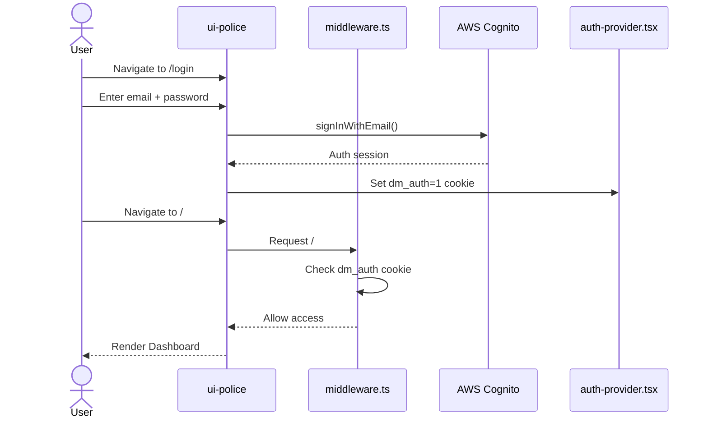

### PlantUML

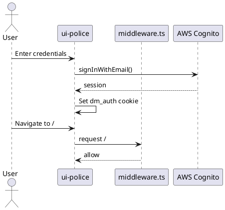

---

## 2. Authentication (API JWT)

Separate surveillance API token acquisition.

### Mermaid

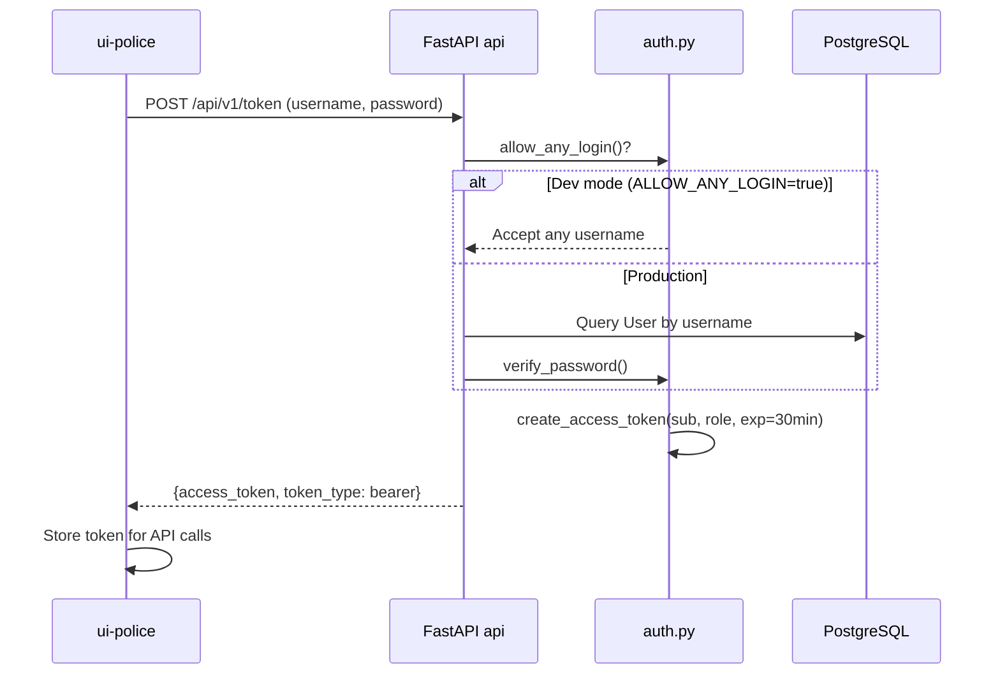

### PlantUML

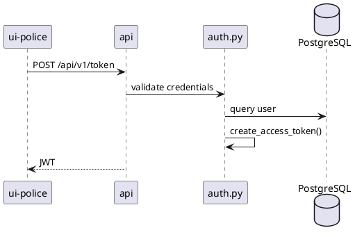

---

## 3. Video Upload (Browser Recording)

### Mermaid

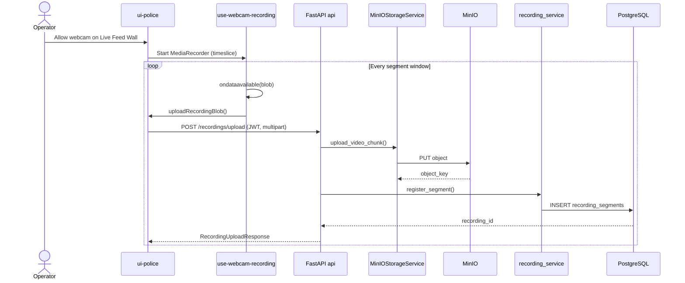

### PlantUML

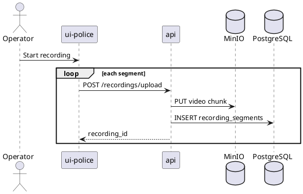

---

## 4. Live Streaming (Frame Push + WebSocket)

### Mermaid

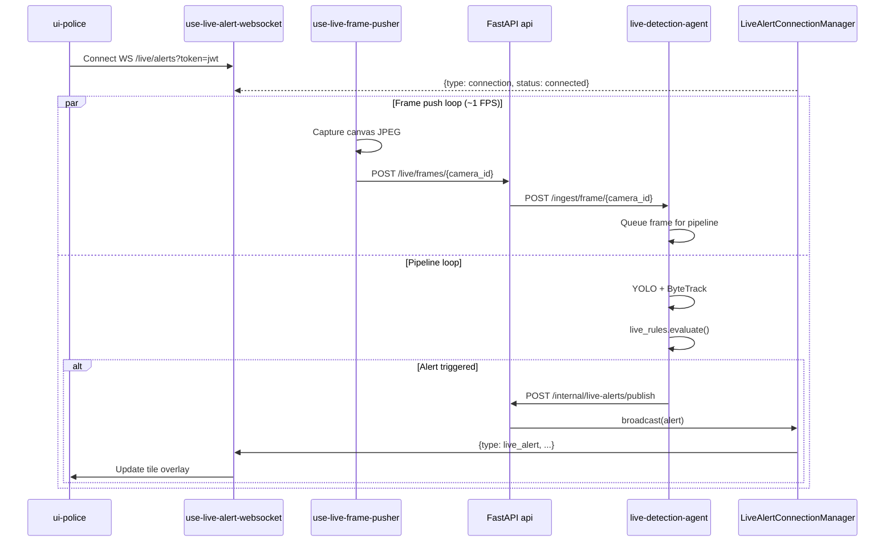

### PlantUML

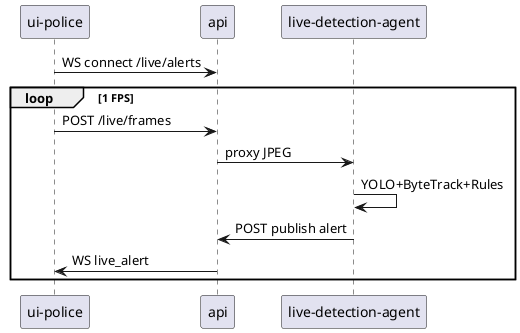

---

## 5. AI Inference (Offline)

### Mermaid

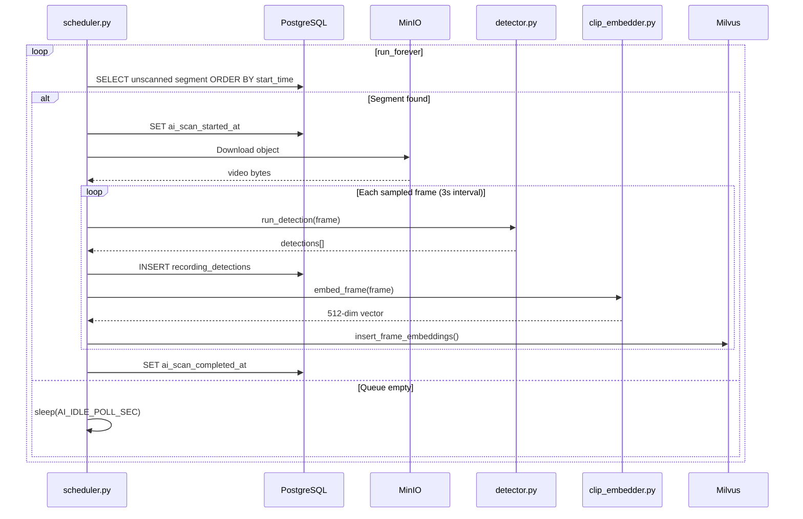

### PlantUML

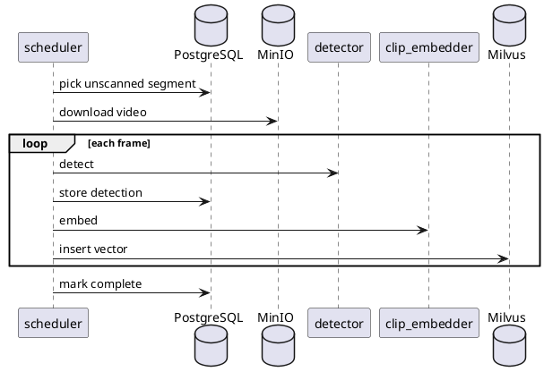

---

## 6. Alert Generation

### Mermaid

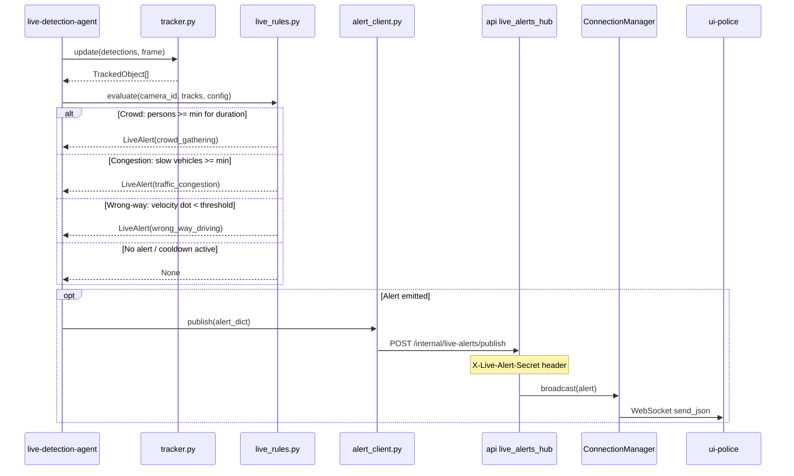

---

## 7. Notification (WebSocket Broadcast)

### Mermaid

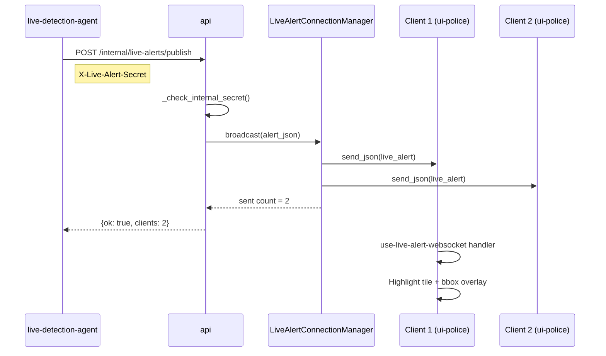

---

## 8. Database Storage

### Mermaid

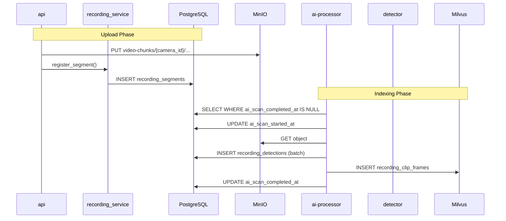

---

## 9. Dashboard Rendering

### Mermaid

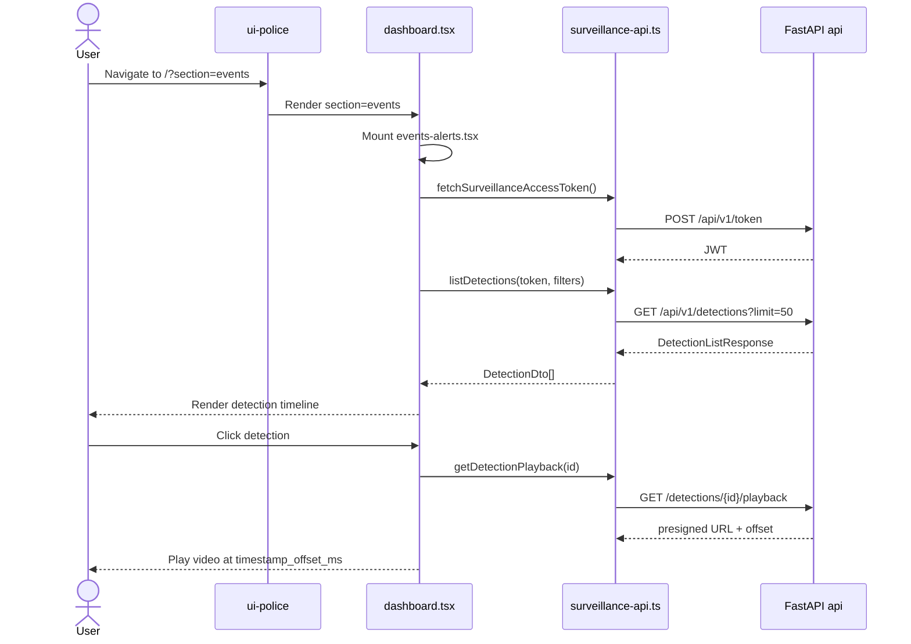

### PlantUML

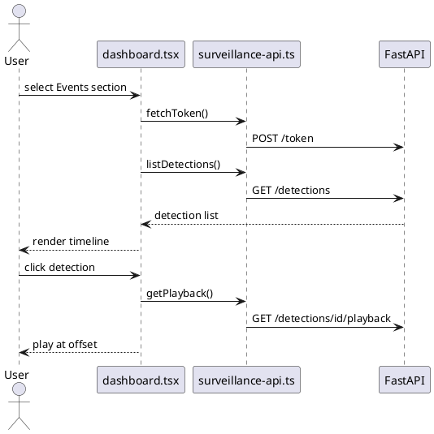

---

## Related Documents

- [03_USE_CASES.md](../03_USE_CASES.md)
- [uml/README.md](../uml/README.md)
- [data-flow/README.md](../data-flow/README.md)
- [07_API_DOCUMENTATION.md](../07_API_DOCUMENTATION.md)
