# UML Diagrams — DigiMitra City

**Document:** UML Model (Mermaid + PlantUML)  
**Notation:** Descriptive labels per DigiMitra domain model

---

## 1. Use Case Diagram

### Mermaid

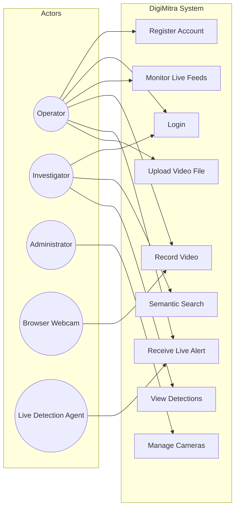

### PlantUML

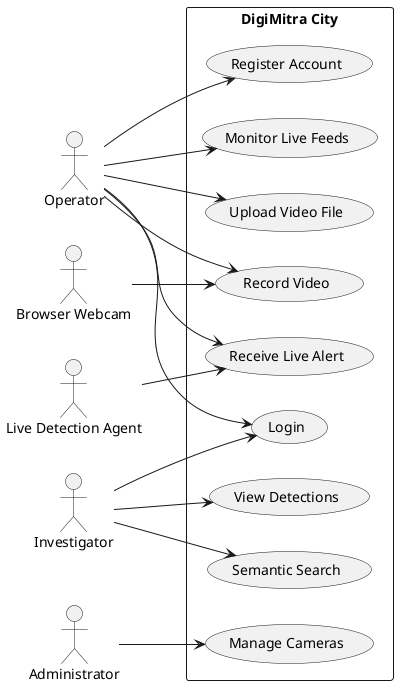

---

## 2. Class Diagram

### Mermaid

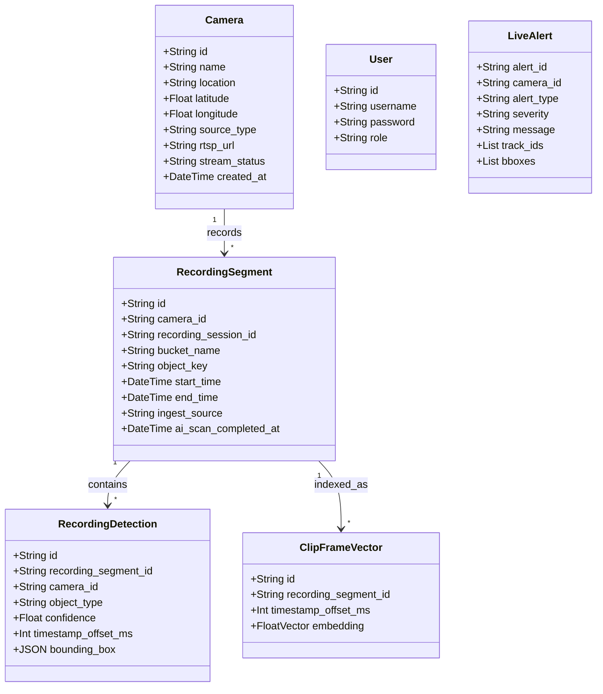

### PlantUML

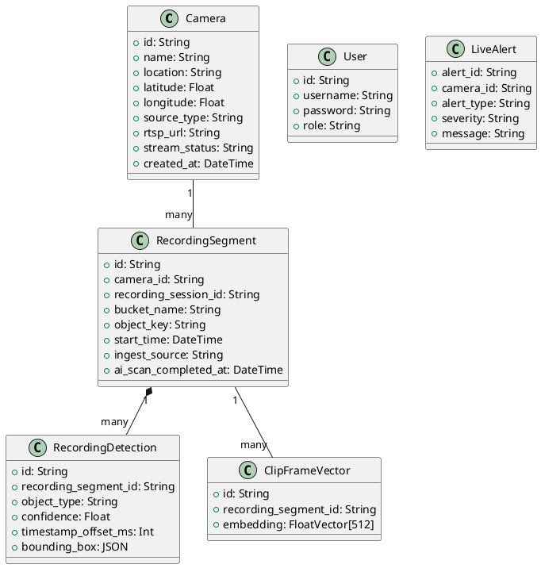

---

## 3. Sequence Diagram (Recording Upload)

### Mermaid

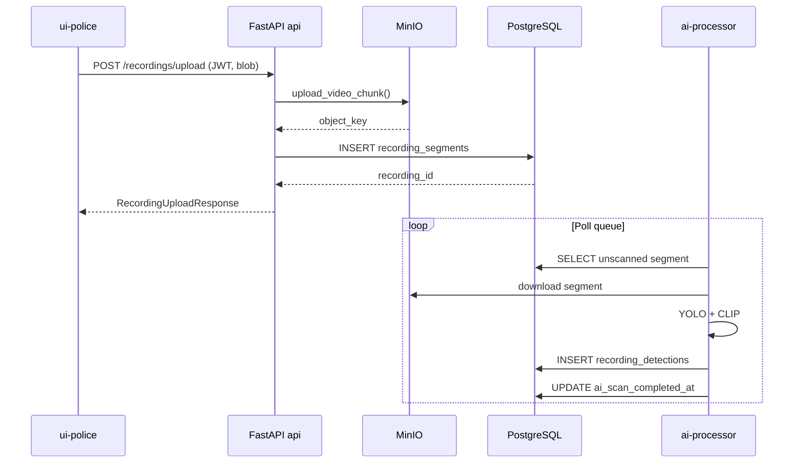

### PlantUML

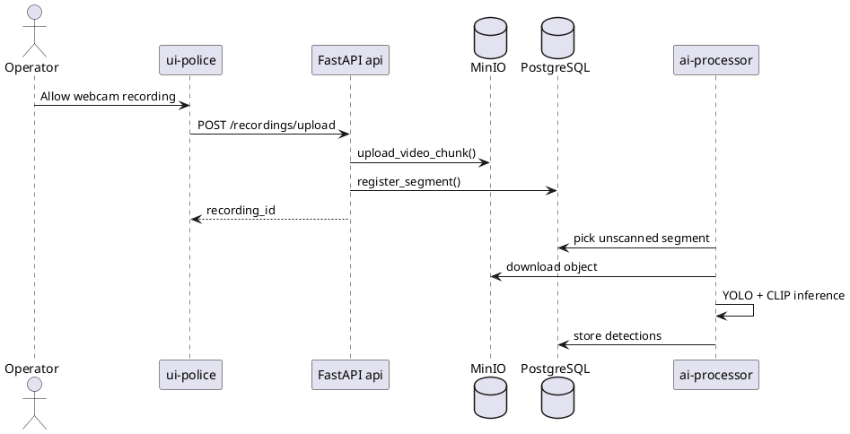

---

## 4. Component Diagram

### Mermaid

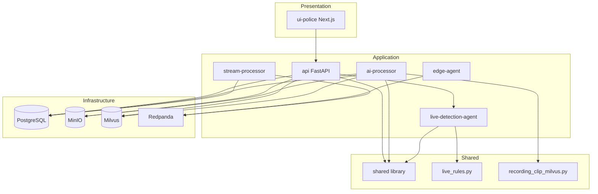

### PlantUML

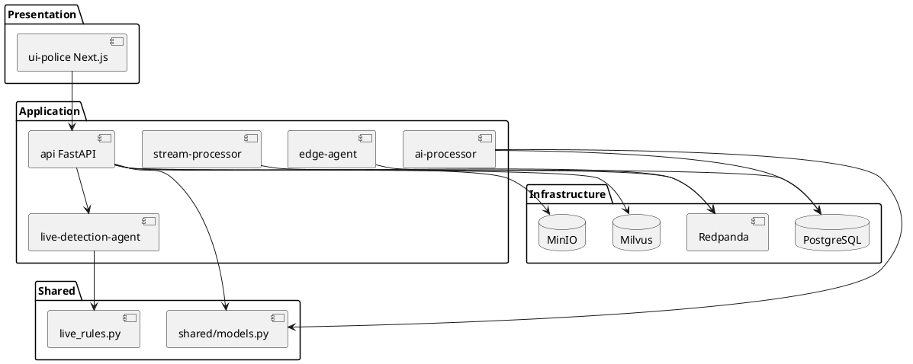

---

## 5. Deployment Diagram

### Mermaid

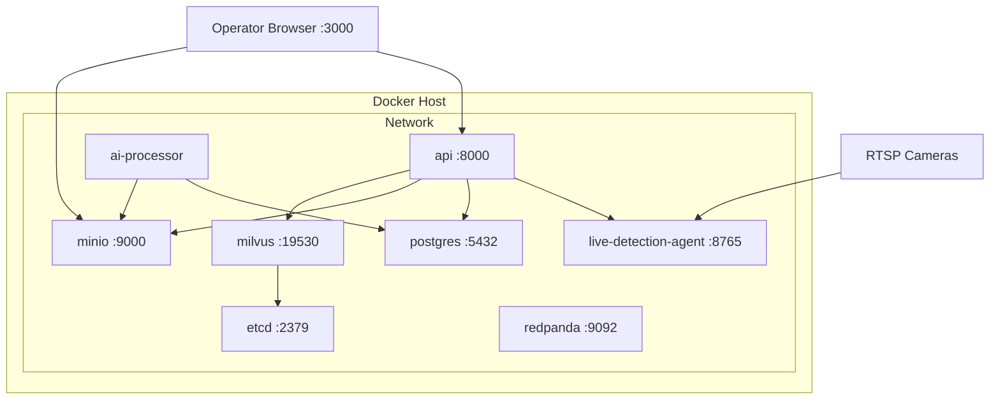

### PlantUML

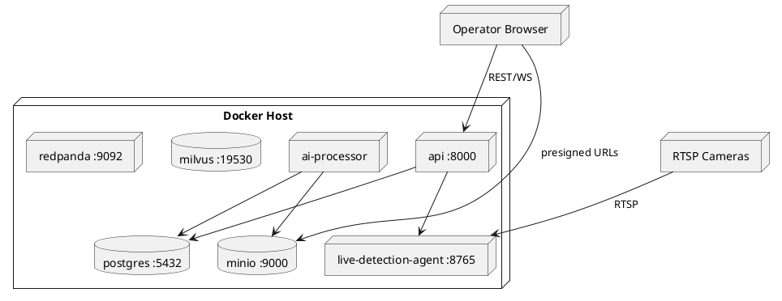

---

## 6. Package Diagram

### Mermaid

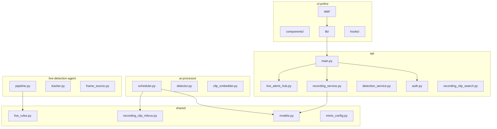

### PlantUML

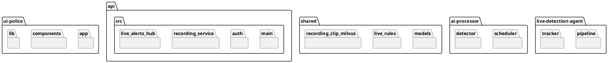

---

## 7. Activity Diagram (Semantic Search)

### Mermaid

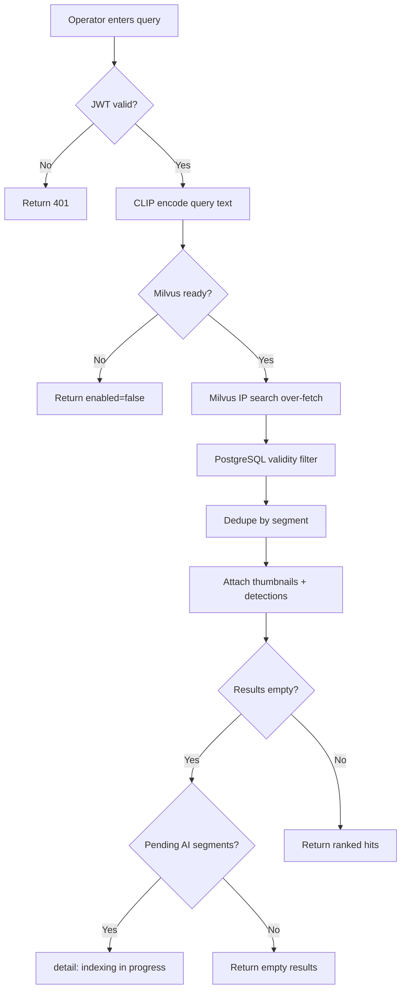

### PlantUML

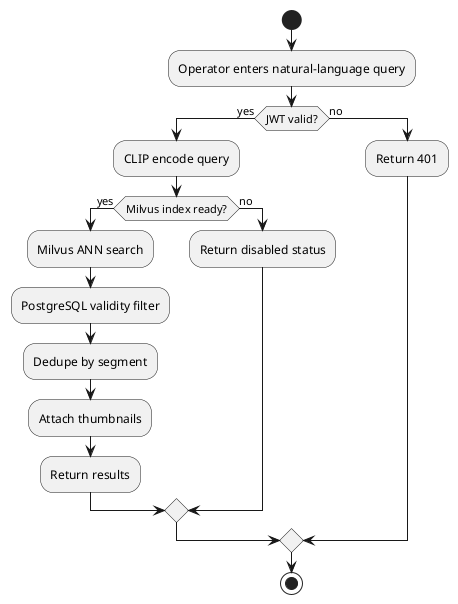

---

## 8. State Diagram (Recording Segment)

### Mermaid

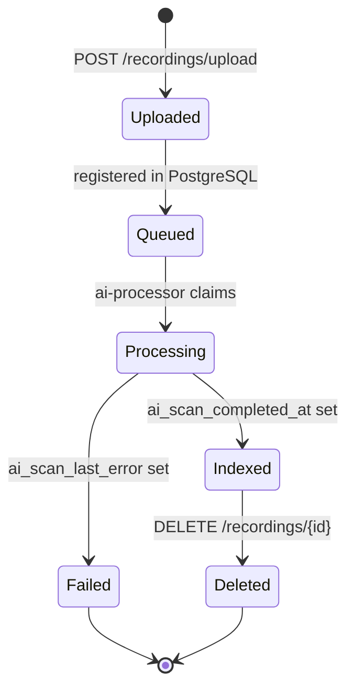

### PlantUML

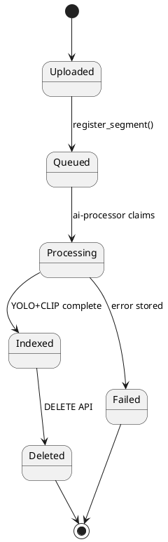

---

## 9. Communication Diagram (Live Alert)

### Mermaid

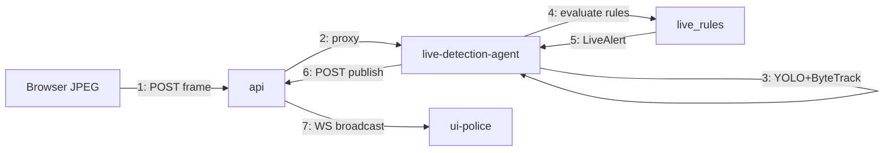

### PlantUML

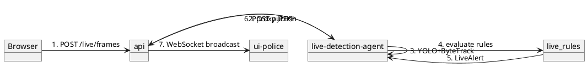

---

## 10. Object Diagram (Live Alert Instance)

### Mermaid

```mermaid
classDiagram
    object alert_001 {
        alert_id = "a1b2c3"
        camera_id = "1"
        alert_type = "crowd_gathering"
        severity = "high"
        message = "Crowd of 10 persons"
        track_ids = [1,2,3]
    }

    object camera_001 {
        id = "1"
        name = "Main Gate Cam"
        stream_status = "online"
    }

    alert_001 --> camera_001 : targets
```

### PlantUML

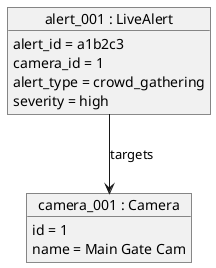

---

## Related Documents

- [sequences/README.md](../sequences/README.md)
- [architecture-4plus1/README.md](../architecture-4plus1/README.md)
- [06_ARCHITECTURE.md](../06_ARCHITECTURE.md)
